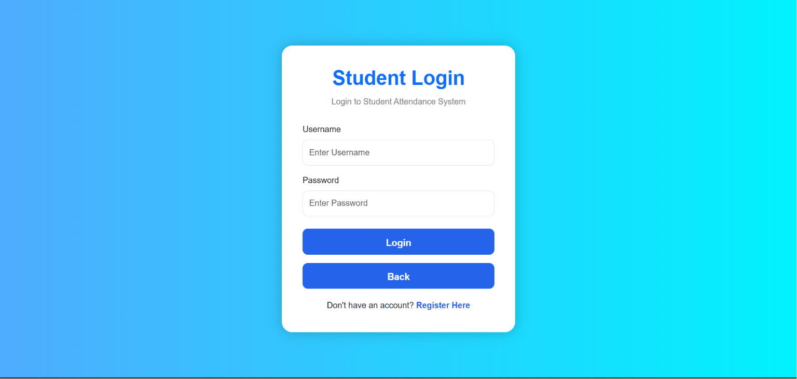
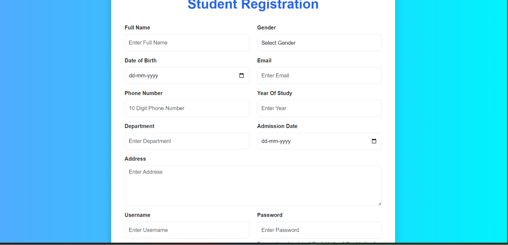
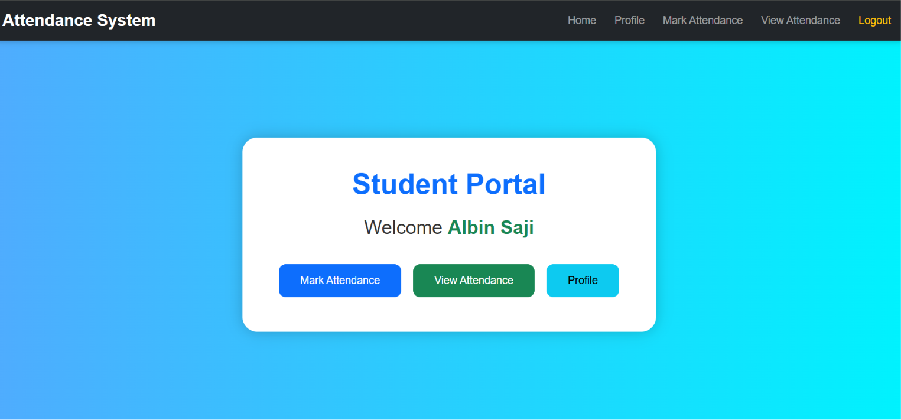
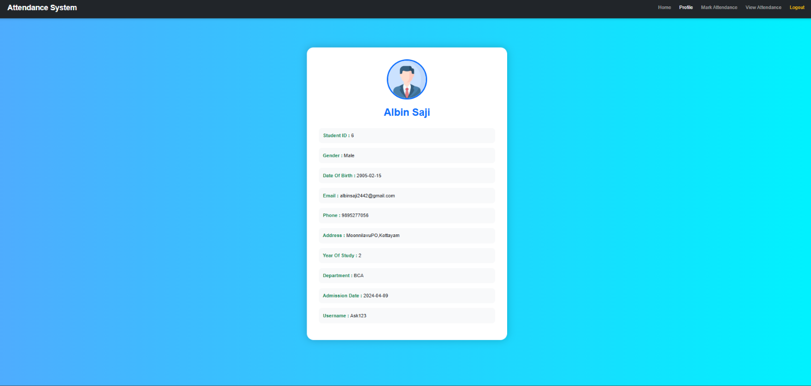
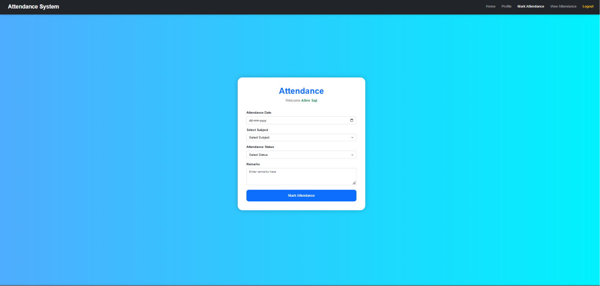
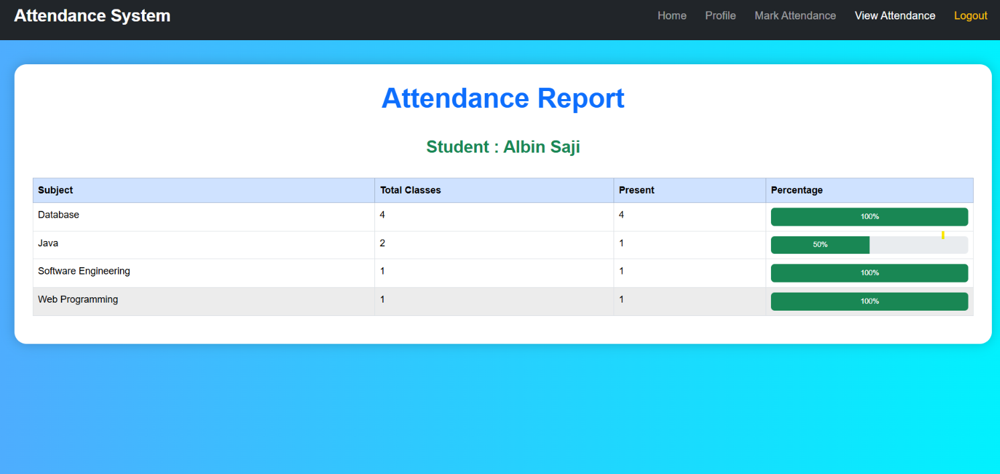

# Student Attendance Management System

## Overview
A web-based attendance management system developed using Java, JSP, Servlets, JDBC, and MySQL.

## Features
- Student Registration
- Student Login
- Attendance Management
- Subject Management
- Attendance Reports

## Technologies Used
- Java
- JSP
- Servlets
- JDBC
- MySQL
- HTML
- CSS

## Screenshots
### Landing Page

### Login Page

### Registration Page

### H0me Page

### Profile Page

### Attendance Marking Page

### Attendace Page

### Attendance View Page

## How to Run

1. Import project into Eclipse.
2. Configure Apache Tomcat.
3. Create MySQL database.
4. Update database credentials.
5. Run the application.

## Modules

- Student Registration
- Student Login
- Attendance Management
- Subject Management
- Attendance Reports

## Author

Albin Saji

LinkedIn:
https://www.linkedin.com/in/albin-saji-273686319

GitHub:
https://github.com/Alby2442
